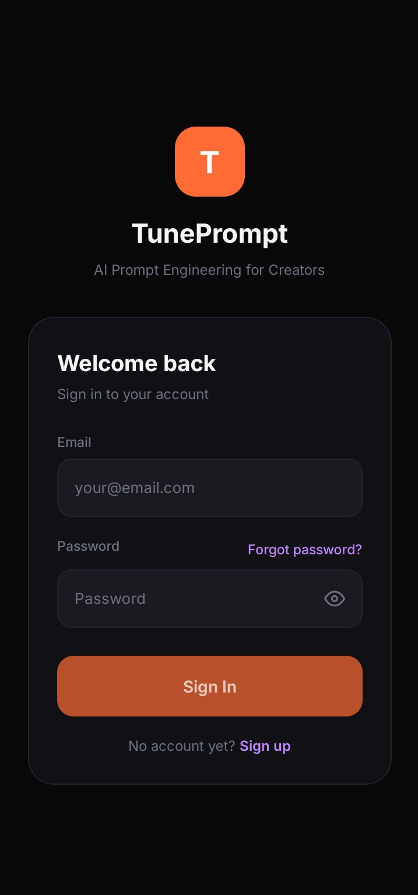
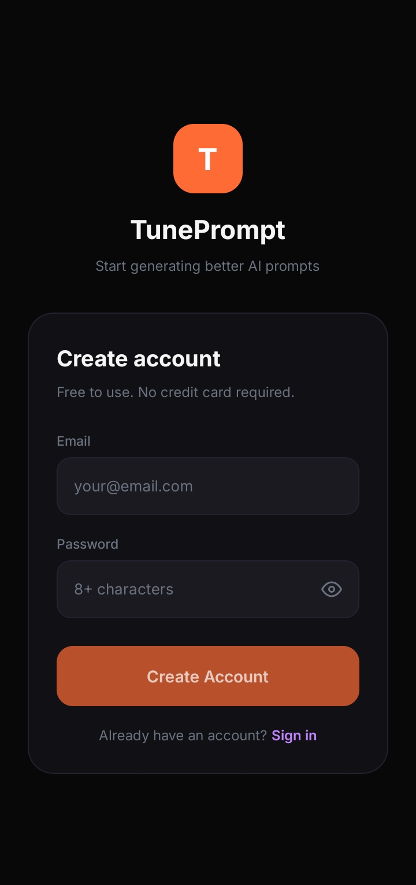
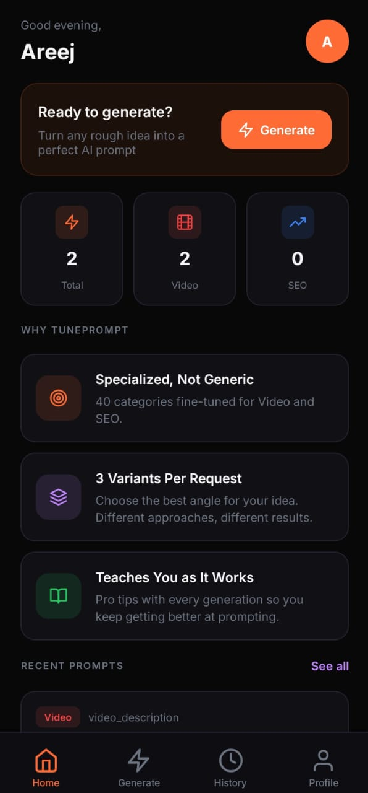
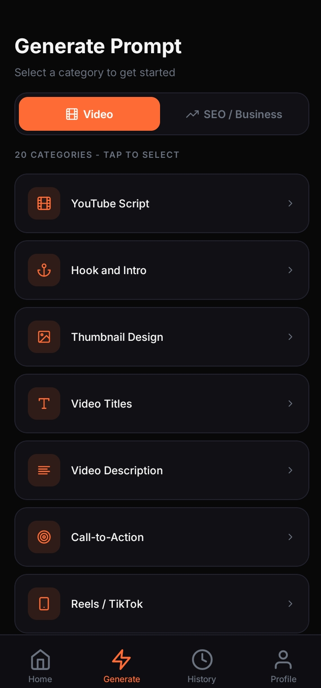
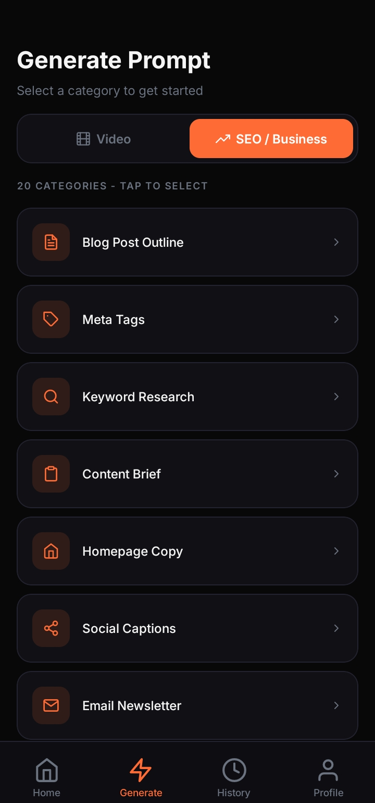
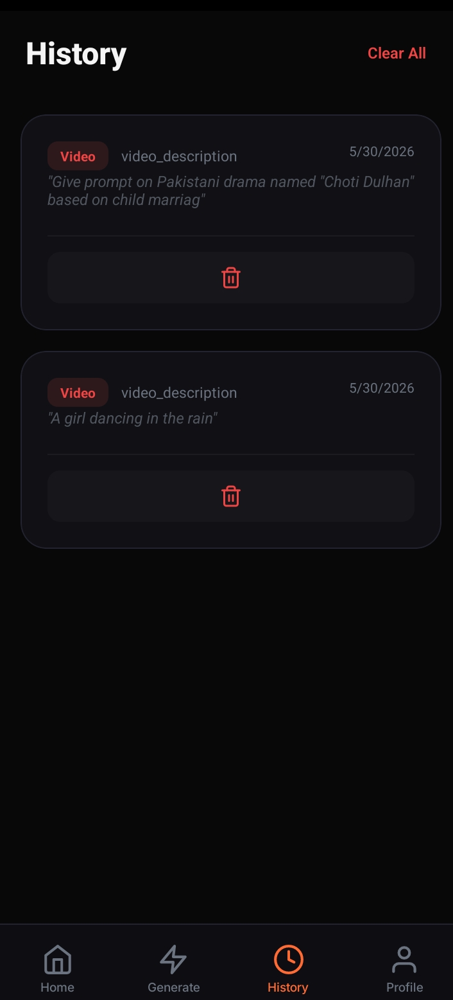
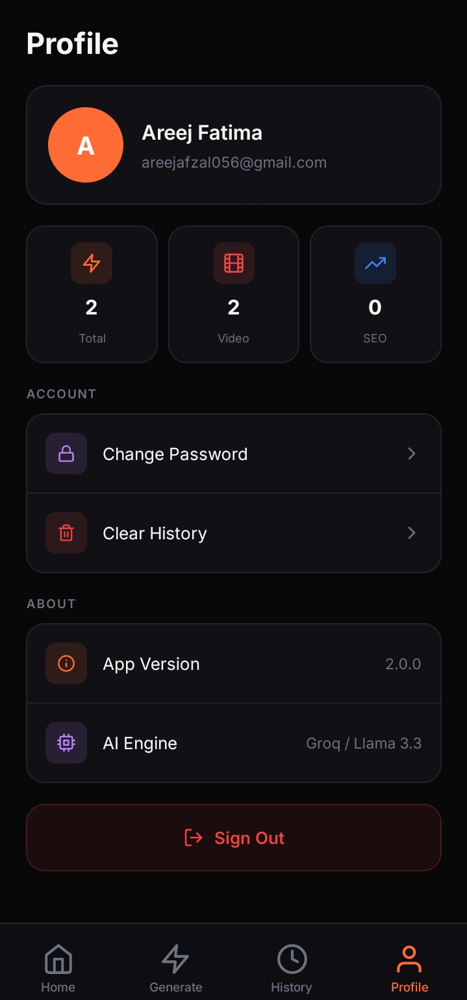

# TunePrompt
Your AI-powered personal prompt generator for video editing, automation, and SEO.

## About the App
TunePrompt is a secure Android application designed to help content creators generate, save, and manage professional grade prompts for video editing, automation workflows, and SEO optimization. Whether you are a video editor looking for B-roll prompts, an automation specialist building workflows, or a digital marketer targeting search rankings, this app streamlines your creative process. It features secure user authentication, a responsive dashboard for history management, and seamless integration with AI models to boost your content production.

## Why TunePrompt? (Purpose & Uniqueness)
While general-purpose LLMs like ChatGPT or Claude are powerful, TunePrompt offers a distinct advantage for professional workflows:

- **Niche-Specific Specialization:** Unlike broad models, TunePrompt is pre configured with 40+ specialized categories tailored specifically for video editing, automation, and SEO. This removes the "blank page" syndrome.
- **Workflow Integration:** TunePrompt acts as a dedicated repository. Instead of scrolling through thousands of unrelated chats in ChatGPT, your creative prompts are organized, searchable, and stored in a clean dashboard built for productivity.
- **Dedicated Prompt Engineering:** We have fine tuned the interaction layer with Groq AI to ensure the outputs are optimized for professional content creation tools and search algorithms, rather than generic conversational text.
- **Efficiency:** By providing a structured UI, we reduce the "prompt engineering" time required to get high quality results, allowing you to focus on the actual creative work.

## App Screenshots
Below are the key interfaces of TunePrompt:

### Getting Started
| Splash Screen | Sign In | Sign Up |
| :---: | :---: | :---: |
|  |  |  |

### Core Functionality
| Dashboard | Category Selection | Prompt Generation |
| :---: | :---: | :---: |
|  |   |  |

### Management & Settings
| History | Profile |
| :---: | :---: | :---: |
|  |  |

## Features
- **User Authentication:** Secure signup and login powered by Clerk.
- **AI Integration:** Real time generation of prompts for video editing, automation, and SEO using Groq AI.
- **Dashboard:** Personalized management of all saved professional prompts.
- **Data Persistence:** Robust data storage using PostgreSQL and Drizzle ORM.
- **Prompt Categories:** 20 specialized categories for video editing/automation, 20 specialized categories for SEO/business.
- **Responsive UI:** A user friendly, clean interface built with React Native.

## Technologies Used
- **Frontend:** React Native, Expo, TypeScript
- **Backend:** Express.js, Node.js
- **Database:** PostgreSQL, Drizzle ORM
- **Authentication:** Clerk
- **AI Engine:** Groq API
- **Build Tool:** PNPM Monorepo

## APK Download
[Download TunePrompt APK](apk/TunePrompt.apk)

## How to Install the APK
1. Download the APK file from the link above.
2. Transfer the file to your Android device.
3. Open the file on your device.
4. If prompted, go to **Settings** and allow "Install from unknown sources."
5. Tap **Install** and launch the application.

## How to Run the Project
1. Clone this repository: `git clone https://github.com/dreams-from-dust/TunePrompt-Project.git`
2. Open the project in your code editor.
3. Run `pnpm install` in the root directory to install all dependencies.
4. Configure your `.env` file with your specific API keys.
5. Run the project using `pnpm start` or build the native project using EAS.

## Privacy Policy
[View Privacy Policy](docs/privacy-policy.pdf)

## User Manual
[View User Manual](docs/user-manual.pdf)

## Future Enhancements
- Export prompt history to PDF/CSV.
- Direct integration with video editing software APIs.
- Advanced AI model selection for different content niches.
- Dark/Light mode customization.

## Developed By
Areej Fatima  
BSIT 6th Semester  
Department of Information Technology, University of Layyah  

**Connect with me:**
- [GitHub Profile](https://github.com/dreams-from-dust/)
- [LinkedIn Profile](https://linkedin.com/in/areej-fatima-it)